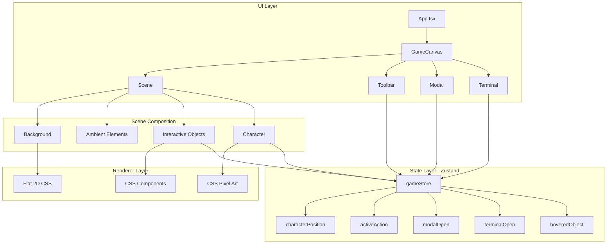

# Day of the Tentacle Portfolio - Milestone 1 Plan

## Phase 0: Visual Art Validation (COMPLETED)

Phase 0 has been completed. The original 3D perspective approach was replaced with a flat 2D approach for better maintainability.

**Pivot Documentation**: See [Flat 2D Scene Pivot](flat_2d_scene_pivot_bb126a5c.plan.md) for details on the change.

### Final Visual Approach: Flat 2D with Depth Illusion

The scene uses a **flat 2D design** where depth is achieved through:

- Single back wall with three color zones (orange/gold/blue)
- Flat checkered floor with gradient overlay (darker at back)
- Drop shadows on all objects
- Y-position determines depth (higher = farther)
- Character scales slightly based on Y position

```
+------------------------------------------------------------------+
|  CEILING (dark purple with beam)                                 |
+------------------------------------------------------------------+
|  ORANGE  |         GOLD/MUSTARD              |       BLUE        |
|   ZONE   |         (center wall)             |       ZONE        |
|  (left)  |         [WELCOME BANNER]          |      (right)      |
+------------------------------------------------------------------+
|  BASEBOARD                                                       |
+------------------------------------------------------------------+
|  [Plant] [Skills] [Character] [Projects]  [Door]                 |
|            FLAT CHECKERED FLOOR                                  |
+------------------------------------------------------------------+
```

### Completed Elements

| Element | File | Status |

| ------------------------- | ------------------------------ | ------ |

| Character (Bernard-style) | `CharacterCSS.tsx/css` | Done |

| Background (flat 2D) | `LobbyBackground.tsx/css` | Done |

| Door (Experience) | `DoorObject.tsx/css` | Done |

| Phone (Contact) | `PhoneObject.tsx/css` | Done |

| Vending Machine (Skills) | `VendingMachineObject.tsx/css` | Done |

| Desk (Projects) | `DeskObject.tsx/css` | Done |

| Framed Sign (Resume) | `FramedSignObject.tsx/css` | Done |

| Plant animation | `PlantAnimated.tsx/css` | Done |

| Clock animation | `ClockAnimated.tsx/css` | Done |

| Flickering sign (About) | `FlickeringSign.tsx/css` | Done |

---

## Architecture Overview



## Tech Stack

- **React 19** + **TypeScript** (existing)
- **Zustand** - Game state management
- **Framer Motion** - Character movement and modal transitions
- **CSS** - All visual rendering (pixel art, backgrounds, animations)

## File Structure

```
src/
├── components/
│   ├── game/
│   │   ├── GameCanvas.tsx        # Scaled viewport container
│   │   ├── Scene.tsx             # Scene composition
│   │   ├── ContentModal.tsx      # Full-screen content overlay
│   │   └── RetroTerminal.tsx     # Command-line interface
│   │
│   ├── entities/
│   │   ├── Character.tsx         # Player character (position + renderer)
│   │   └── InteractiveObject.tsx # Base for clickable objects
│   │
│   ├── renderers/
│   │   ├── character/
│   │   │   └── CharacterCSS.tsx
│   │   ├── background/
│   │   │   └── LobbyBackground.tsx
│   │   ├── objects/
│   │   │   ├── DoorObject.tsx
│   │   │   ├── PhoneObject.tsx
│   │   │   ├── VendingMachineObject.tsx
│   │   │   ├── DeskObject.tsx
│   │   │   └── FramedSignObject.tsx
│   │   └── ambient/
│   │       ├── PlantAnimated.tsx
│   │       ├── ClockAnimated.tsx
│   │       └── FlickeringSign.tsx
│   │
│   └── toolbar/
│       ├── Toolbar.tsx
│       ├── ActionGrid.tsx
│       └── IconGrid.tsx
│
├── store/
│   └── gameStore.ts
│
├── hooks/
│   ├── useCharacterMovement.ts
│   ├── useSceneClick.ts
│   └── useTerminal.ts
│
├── types/
│   └── game.ts
│
├── config/
│   ├── scene.ts                  # Object positions, hotspots
│   └── commands.ts               # Terminal command definitions
│
├── styles/
│   ├── variables.css
│   └── animations.css
│
└── content/
    ├── experience.ts
    ├── projects.ts
    ├── skills.ts
    └── about.ts
```

---

## Phase 1: Foundation Setup

### 1.1 Install Dependencies

```bash
npm install zustand framer-motion
```

### 1.2 Create Core Types

File: `src/types/game.ts`

```typescript
export interface Position {
  x: number;
  y: number;
}
export type Direction = "left" | "right";
export type CharacterState = "idle" | "walking" | "interacting";
export type ActionType =
  | "experience"
  | "projects"
  | "skills"
  | "about"
  | "contact"
  | "resume";

export interface InteractiveObjectConfig {
  id: string;
  position: Position;
  size: { width: number; height: number };
  action: ActionType;
  label: string;
}
```

### 1.3 Create Game Store

File: `src/store/gameStore.ts`

```typescript
interface GameState {
  // Character
  characterPosition: Position;
  characterDirection: Direction;
  characterState: CharacterState;
  targetPosition: Position | null;

  // Interaction
  hoveredObject: string | null;
  activeAction: ActionType | null;
  modalOpen: boolean;
  terminalOpen: boolean;

  // Actions
  moveTo: (position: Position) => void;
  setHoveredObject: (id: string | null) => void;
  triggerAction: (action: ActionType, targetPos: Position) => void;
  closeModal: () => void;
  toggleTerminal: () => void;
}
```

### 1.4 Create Scaled Viewport Container

File: `src/components/game/GameCanvas.tsx`

- Fixed internal resolution: **640x400** (classic SCUMM ratio)
- Scene area: 640x320 (top)
- Toolbar area: 640x80 (bottom)
- CSS transform scale to fit viewport
- Coordinate translation for click events

```typescript
// Scale calculation
const scale = Math.min(window.innerWidth / 640, window.innerHeight / 400);
```

### 1.5 Create Scene Configuration

File: `src/config/scene.ts`

```typescript
export const SCENE_CONFIG = {
  width: 640,
  height: 320,
  characterStart: { x: 300, y: 40 },
  walkableArea: { minY: 20, maxY: 64 }, // Floor area (bottom values)
  objects: [
    {
      id: "experience",
      position: { x: 580, y: 70 },
      action: "experience",
      label: "Office Door",
    },
    {
      id: "projects",
      position: { x: 340, y: 45 },
      action: "projects",
      label: "Desk",
    },
    {
      id: "skills",
      position: { x: 160, y: 45 },
      action: "skills",
      label: "Vending Machine",
    },
    {
      id: "contact",
      position: { x: 580, y: 130 },
      action: "contact",
      label: "Phone",
    },
    {
      id: "resume",
      position: { x: 115, y: 115 },
      action: "resume",
      label: "Resume",
    },
    {
      id: "about",
      position: { x: 28, y: 85 },
      action: "about",
      label: "About Sign",
    },
  ],
};
```

---

## Phase 2: Character Movement

### 2.1 Integrate Character with Store

Update `Scene.tsx` to read position from Zustand store and animate with Framer Motion.

### 2.2 Create Movement Hook

File: `src/hooks/useCharacterMovement.ts`

- Handle click-to-move on scene floor
- Constrain movement to walkable area (Y: 20-64)
- Update direction based on movement
- Apply scale based on Y position (existing `getScaleForY`)

### 2.3 Add Keyboard Controls

- Arrow keys: Move character in direction
- Constrain to walkable bounds
- Update direction on key press

---

## Phase 3: Toolbar

### 3.1 Create Toolbar Container

```
+------------------+------------------+------------------+
|   ACTION GRID    |   STATUS TEXT    |    ICON GRID     |
|  [Experience]    |  "Walk to..."    |  [GitHub]        |
|  [Projects]      |                  |  [LinkedIn]      |
|  [Skills]        |                  |  [Terminal]      |
+------------------+------------------+------------------+
```

### 3.2 Create ActionGrid

- 2x3 grid layout
- Actions: Experience, Projects, Skills, About, Contact, Resume
- Beveled button style (CSS inset/outset borders)

### 3.3 Create IconGrid

- GitHub, LinkedIn, Email icons
- **Terminal icon** - opens retro terminal overlay
- Pixel art style icons

---

## Phase 4: Interaction Flow

### 4.1 Action Flow

1. User clicks toolbar button or scene object
2. Character walks to target position
3. On arrival, modal opens with content

### 4.2 Create Content Modal

- Slides in from right
- Styled like a new "room" with retro border
- Close button (X) in corner
- Escape key to close

---

## Phase 5: Retro Terminal Interface (NEW)

A command-line interface for keyboard-first users and developers who prefer terminal navigation.

### 5.1 Terminal Design

```
+------------------------------------------------------------------+
|  FLOROZ PORTFOLIO v1.0                              [X] Close     |
|  Type 'help' for available commands                               |
+------------------------------------------------------------------+
|  > help                                                           |
|                                                                   |
|  Available commands:                                              |
|    about      - About me                                          |
|    experience - Work experience                                   |
|    projects   - View projects                                     |
|    skills     - Technical skills                                  |
|    contact    - Contact information                               |
|    resume     - Download resume                                   |
|    clear      - Clear terminal                                    |
|    help       - Show this help                                    |
|                                                                   |
|  > _                                                              |
+------------------------------------------------------------------+
```

### 5.2 Terminal Features

- **Activation**: Press backtick (`) or click terminal icon in toolbar
- **Scanline effect**: CSS overlay for retro CRT look
- **Typing animation**: Characters appear one at a time
- **Command history**: Arrow up/down to navigate previous commands
- **Tab completion**: Auto-complete command names
- **Easter eggs**: Hidden commands like `sudo`, `rm -rf`, `matrix`

### 5.3 Terminal Commands

File: `src/config/commands.ts`

```typescript
export const TERMINAL_COMMANDS = {
  help: { description: "Show available commands", action: "showHelp" },
  about: { description: "About me", action: "openModal", payload: "about" },
  experience: {
    description: "Work experience",
    action: "openModal",
    payload: "experience",
  },
  projects: {
    description: "View projects",
    action: "openModal",
    payload: "projects",
  },
  skills: {
    description: "Technical skills",
    action: "openModal",
    payload: "skills",
  },
  contact: {
    description: "Contact info",
    action: "openModal",
    payload: "contact",
  },
  resume: { description: "Download resume", action: "downloadResume" },
  clear: { description: "Clear terminal", action: "clearTerminal" },
  ls: { description: "List sections", action: "listSections" },
  cd: { description: "Navigate to section", action: "navigate" },
  whoami: { description: "Show user info", action: "showWhoami" },
  // Easter eggs
  sudo: { hidden: true, action: "showSudoJoke" },
  matrix: { hidden: true, action: "showMatrixEffect" },
  exit: { description: "Close terminal", action: "closeTerminal" },
};
```

### 5.4 Terminal Styling

```css
.terminal {
  background: #0a0a0a;
  color: #00ff00;
  font-family: "IBM Plex Mono", "Courier New", monospace;
  font-size: 14px;
  padding: 16px;
  border: 4px solid #333;
  box-shadow: inset 0 0 100px rgba(0, 255, 0, 0.1);
}

/* Scanline effect */
.terminal::before {
  content: "";
  position: absolute;
  inset: 0;
  background: repeating-linear-gradient(
    0deg,
    rgba(0, 0, 0, 0.15),
    rgba(0, 0, 0, 0.15) 1px,
    transparent 1px,
    transparent 2px
  );
  pointer-events: none;
}

/* Blinking cursor */
.terminal__cursor {
  animation: blink 1s step-end infinite;
}

@keyframes blink {
  50% {
    opacity: 0;
  }
}
```

### 5.5 Terminal Component Structure

```typescript
// src/components/game/RetroTerminal.tsx
interface TerminalProps {
  isOpen: boolean;
  onClose: () => void;
}

const RetroTerminal: React.FC<TerminalProps> = ({ isOpen, onClose }) => {
  const [history, setHistory] = useState<string[]>([]);
  const [input, setInput] = useState("");
  const [commandHistory, setCommandHistory] = useState<string[]>([]);
  const [historyIndex, setHistoryIndex] = useState(-1);

  const executeCommand = (cmd: string) => {
    // Parse and execute command
    // Update history with output
  };

  return (
    <AnimatePresence>
      {isOpen && (
        <motion.div
          className="terminal"
          initial={{ opacity: 0, y: 20 }}
          animate={{ opacity: 1, y: 0 }}
          exit={{ opacity: 0, y: 20 }}
        >
          <div className="terminal__header">
            <span>FLOROZ PORTFOLIO v1.0</span>
            <button onClick={onClose}>[X]</button>
          </div>
          <div className="terminal__output">
            {history.map((line, i) => (
              <div key={i}>{line}</div>
            ))}
          </div>
          <div className="terminal__input">
            <span>&gt; </span>
            <input
              value={input}
              onChange={(e) => setInput(e.target.value)}
              onKeyDown={handleKeyDown}
              autoFocus
            />
            <span className="terminal__cursor">_</span>
          </div>
        </motion.div>
      )}
    </AnimatePresence>
  );
};
```

---

## Phase 6: Accessibility

### 6.1 Keyboard Navigation

| Key | Action |

| ------------ | ----------------------- |

| Arrow keys | Move character |

| Tab | Cycle toolbar buttons |

| Enter | Activate focused button |

| Escape | Close modal/terminal |

| Backtick (`) | Toggle terminal |

### 6.2 Focus Management

- Visible focus rings on all interactive elements
- Focus trap in modal/terminal when open
- Return focus to trigger element on close

### 6.3 Reduced Motion

```css
@media (prefers-reduced-motion: reduce) {
  .character,
  .modal,
  .terminal,
  .ambient {
    animation: none !important;
    transition: none !important;
  }
}
```

---

## Milestone 1 Deliverables Summary

| Phase | Deliverable | Status |

| ----- | --------------------------------- | ------ |

| **0** | Visual prototype (flat 2D) | DONE |

| **1** | Zustand store, types, GameCanvas | DONE |

| **2** | Character movement (click + keys) | DONE |

| **3** | Toolbar with actions + icons | DONE |

| **4** | Action flow (walk -> modal) | DONE |

| **5** | Retro terminal interface | DONE |

| **6** | Keyboard navigation + a11y | DONE |

---

## Future Milestones (Out of Scope for M1)

- **Milestone 2**: Complete all action content (Projects, Skills, About, Contact, Resume)
- **Milestone 3**: Scene polish - more ambient animations, particle effects
- **Milestone 4**: Custom cursor (crosshair like DotT)
- **Milestone 5**: Sound effects (optional, with mute toggle)
- **Milestone 6**: Mobile adaptation (touch controls)
- **Milestone 7**: Multiple "rooms" / scene transitions
